### Heroku Architecture

Heroku is a cloud platform based on a **managed container system**, with integrated data services and a powerful ecosystem, for deploying and running modern apps. 

The Heroku developer experience is an **app-centric approach for software delivery**, integrated with today’s most popular developer tools and workflows.

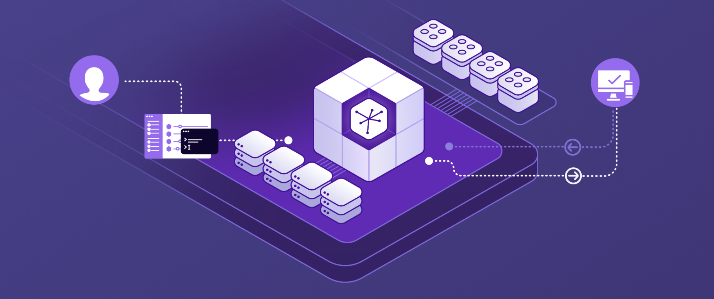

 
 

**Flow**

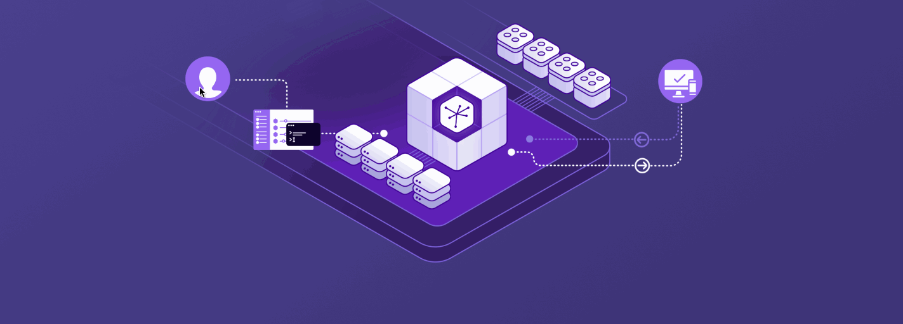

----

**Heroku Runtime**

Heroku runs your apps inside **dynos** — smart containers on a reliable, fully managed runtime environment.

Developers deploy their code written in Node, Ruby, Java, PHP, Python, Go, Scala, or Clojure to a build system which produces an app that's ready for execution. 

The system and language stacks are monitored, patched, and upgraded, so it's always ready and up-to-date. The runtime keeps apps running without any manual intervention.

-----

**Scale**

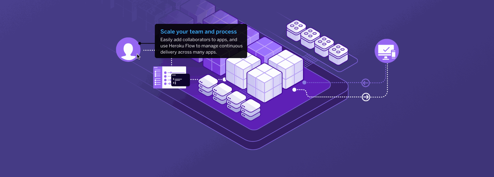

-----

**Developer-centric**

At Heroku, we believe that developers are the most important part of transforming every company into an apps company. That’s why a great developer experience has always been at the very heart of what we do. 

Heroku understands what adds value to developers and what gets in the way. 

We move all the mundane tasks out of the way and add features and functionality that **delight and inspire developers** to do their best work.

-----

**App-centric**

The Heroku Platform is designed so you can focus on what matters the most: the app. 

Getting apps out in the wild, in front of real users, and then iterating fast, is what can make or break companies. 

Heroku lets companies of all sizes embrace the value of apps, not the hassle of hardware, nor the distraction of servers — virtual or otherwise.

-----

**Production-centric**

The Heroku Platform is great for the early part of the app lifecycle, but it really shines when you go into production. 

Heroku seamlessly supports every step of the app lifecycle — build, run, manage and scale. 

Heroku Postgres provides **trusted database options at terabyte scale**. Dyno choices to suit your needs, including performance dynos for your highest traffic apps — all scalable in an instant.

 Heroku keeps the **kernel up-to-date** with the **latest security patches**. All backed by the **trust and reliability of Salesforce**.

-----

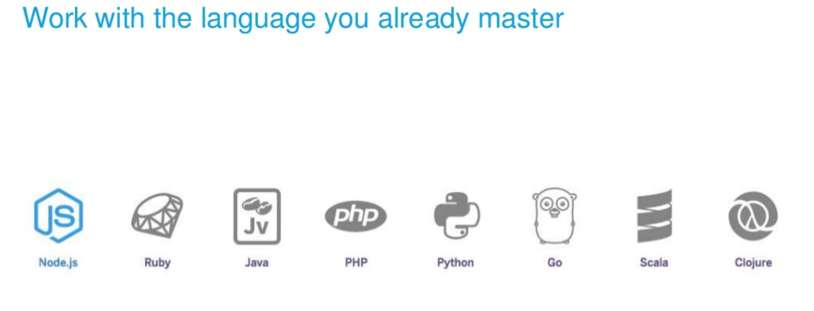
----

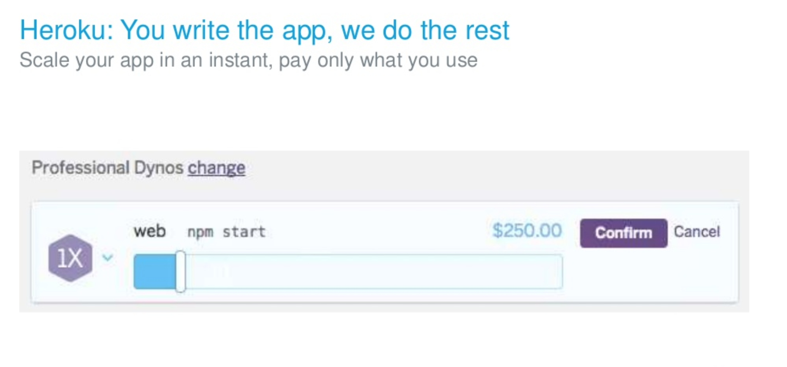
----

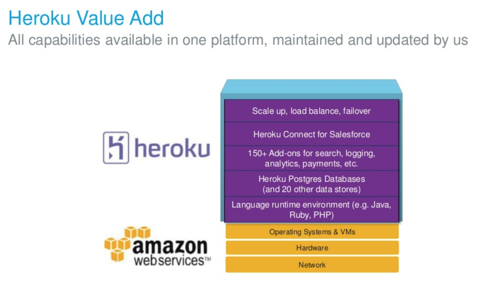
----

----

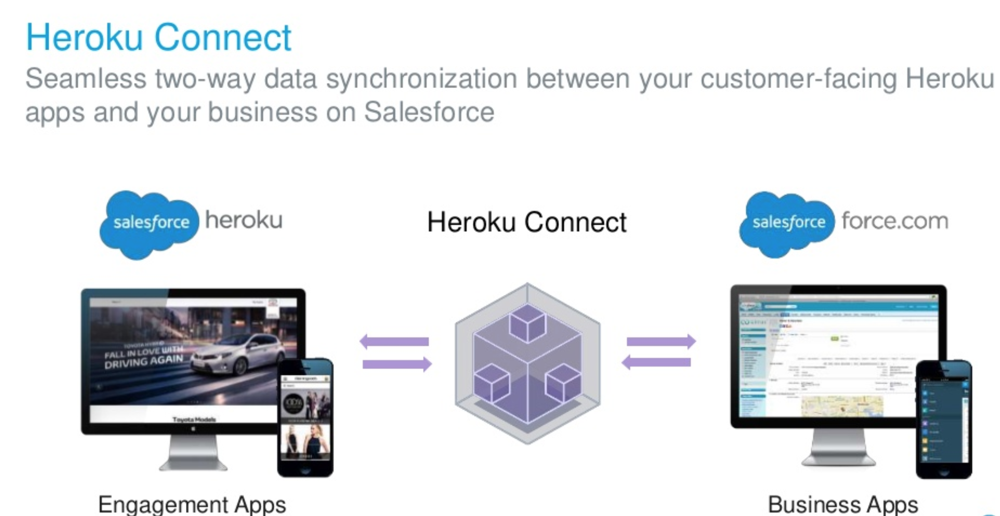
----

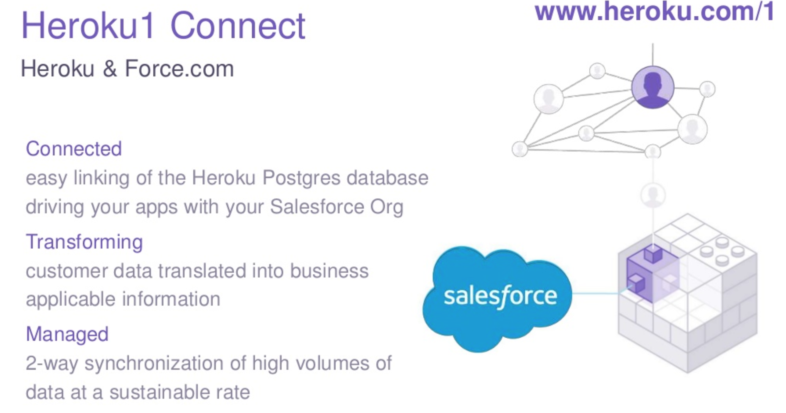
----

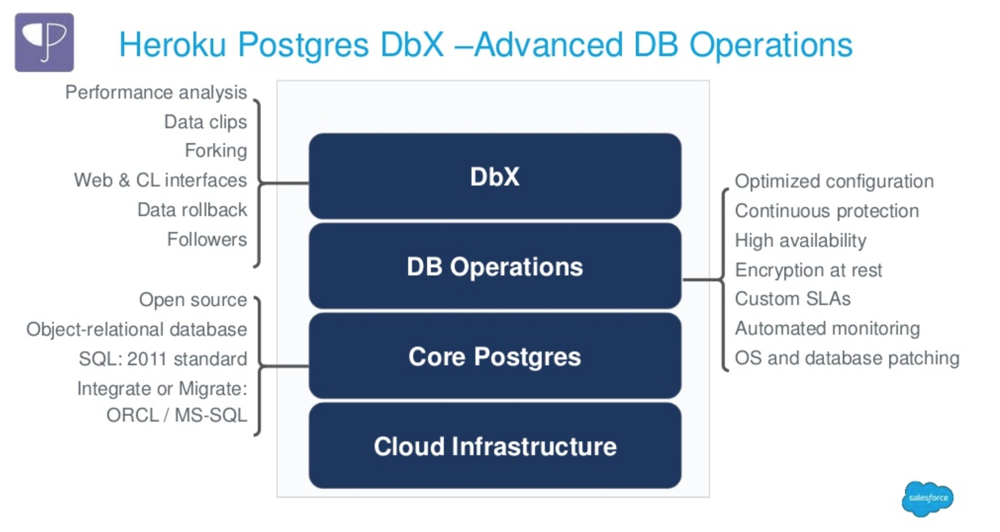
----

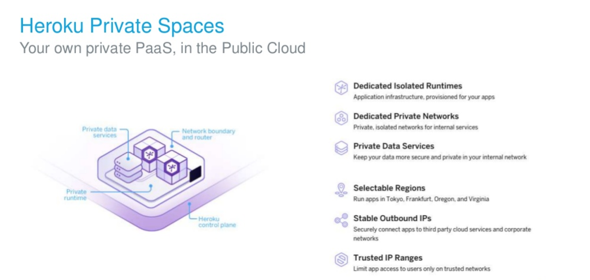

[More details](ps.md)
----

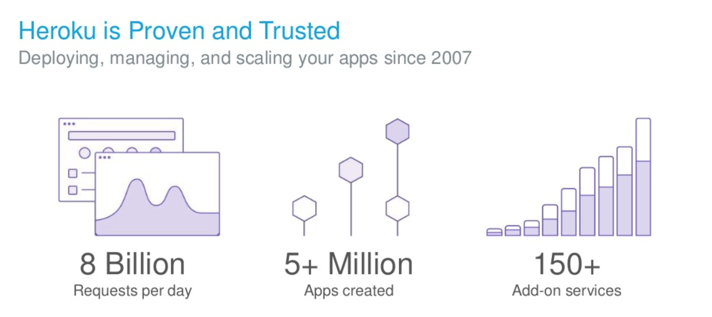
----

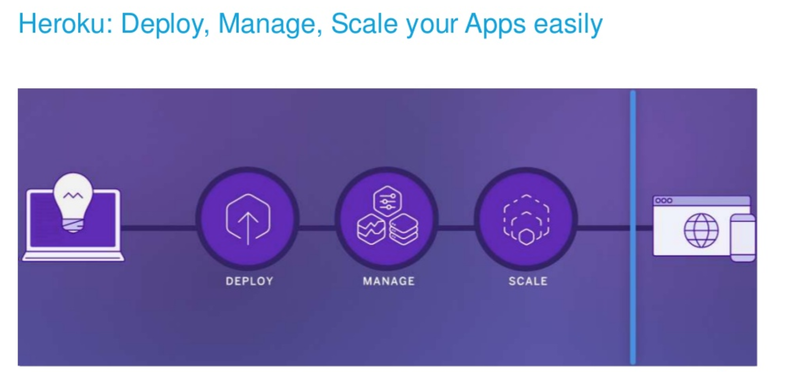
----

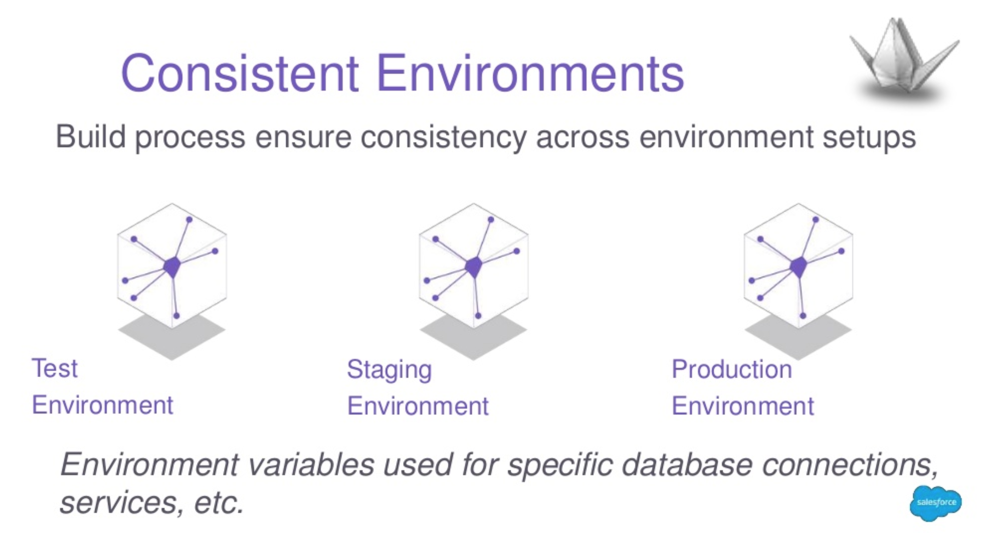
----
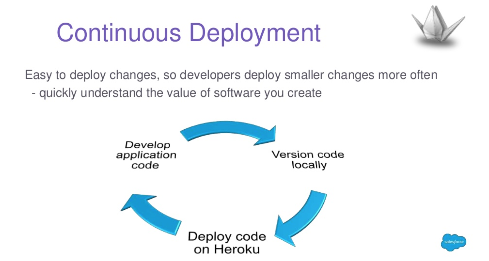
----

#### Resources

1. [Platform](https://www.heroku.com/platform)

