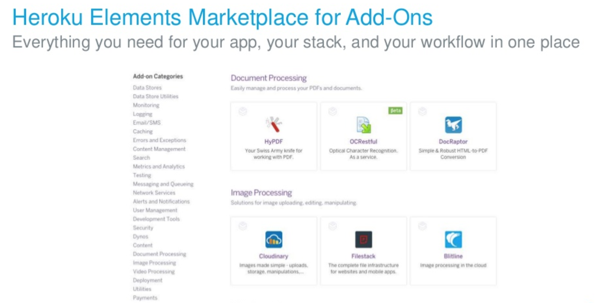

### Heroku Architecture

Heroku is a cloud platform based on a **managed container system**, with integrated data services and a powerful ecosystem, for deploying and running modern apps. 

The Heroku developer experience is an **app-centric approach for software delivery**, integrated with today’s most popular developer tools and workflows.

 
 

**Flow**

----

**Heroku Runtime**

Heroku runs your apps inside **dynos** — smart containers on a reliable, fully managed runtime environment.

Developers deploy their code written in Node, Ruby, Java, PHP, Python, Go, Scala, or Clojure to a build system which produces an app that's ready for execution. 

The system and language stacks are monitored, patched, and upgraded, so it's always ready and up-to-date. The runtime keeps apps running without any manual intervention.

-----

**Scale**

----

----

----

----

----

----

----

[More details](ps.md)
----

----

----

----

----

#### Resources

1. [Platform](https://www.heroku.com/platform)

