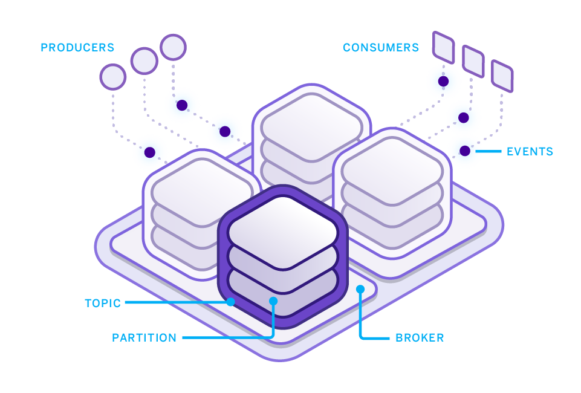

#### Apache Kafka on Heroku

What is Kafka?

Apache Kafka is a distributed commit log for fast, fault-tolerant communication **between producers and consumers** using message based topics.

Kafka provides the messaging backbone for building a new generation of distributed applications capable of handling billions of events and millions of transactions.

----

**Take control of your events**

Events are everywhere — user activity streams, log events, telemetry from embedded devices and mobile phones, and more. 

Kafka flips the script from push to pull, letting you take control of high volume event streams in your applications to transform the customer experience. 

With Kafka, you can accept inbound events at any scale with ease and route them to key-based partitions, providing a clear path to real-time stream processing for user activity tracking, ad tracking, IoT, mobile sync and messaging systems.

**Build modern application architectures**

Application architectures like microservices require new approaches to coordination, scaling and orchestration. 

Kafka’s pull based communication model reduces backpressure on key services under load, letting you add and scale new services independently. 

Kafka enables moving from actor to channel centric app dev models, simplifying services discovery and reducing brittle RPC style and many-to-many coordination between services.

 
**New ways to process data and time**

Kafka lets you rethink the relationship between data, time and operations in your application.

 Kafka takes transactional data in tables and reduces it to a series of events, each representing a keyed record and operation at a point in time. 
 
 This lets you create a record of all change events in your application for data recovery, replay, simulation and auditing. 
 
 These same primitives let you build powerful data processing pipelines for analytics and transformation use cases, with consumers reading data from a set of topics, applying functions, and writing the output to a new set of topics.

------

#### Kafka on Heroku

You can consume Kafka as a service with Heroku’s world-class orchestration and thoughtfully tuned configurations that keep Kafka fast and robust. 

We distribute Kafka resources across network zones for fault-tolerance, and ensure your Kafka cluster is always available and addressable.

**Elegant developer experience**

Easy to use CLI and web tooling make Kafka simple to provision, configure and operate. Add topics, create partitions, manage log compaction, and monitor key metrics from the comfort of the CLI or Heroku Dashboard.

**Seamless integration with apps**

Run producers and consumers as Heroku apps for simple vertical and horizontal scalability. Config vars make it easy to securely connect to your Kafka cluster, so you can focus on your core logic.

----

#### Sample Kafka Demo

This system consumes data from the Twitter Streaming API, manipulates the data using a series of Heroku apps, and generates a dynamic visualization of the manipulated data.

The Kafka cluster is represented by the large light purple rectangle. Within that, each named rectangle represents a Kafka topic. The hexagons are Heroku apps that manipulate data. They produce data to and/or consume data from Kafka topics.

The architecture uses five Heroku apps, each serving a different role in the data pipeline.

1. Data Ingest: Read from Twitter streaming API and produce messages for high volume ingest on Kafka topic

2. Data Fanout: Consume ingested messages and fans out to discrete keyword Kafka topics

3. Aggregate Statistic Calculation: Consume messages from keyword Kafka topics, and calculate and produce aggregate mention count to a topic

4. Related Terms Generation: Consumes messages from keyword Kafka topics, and produce related words & related word count to a topic

5. Visualization: Consume messages from aggregate and related words Kafka topics and generate the dynamic stream visualizations in a web application

