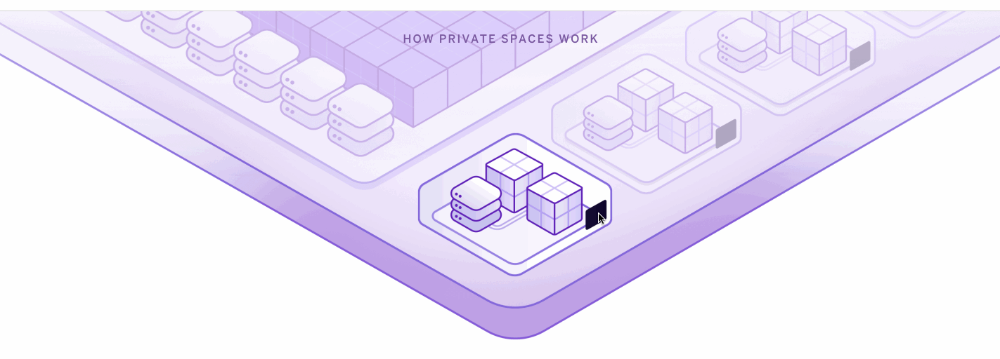

### Heroku Private Spaces

##### What are Private Spaces?

A Private Space, part of Heroku Enterprise, is a network isolated group of apps and data services with a dedicated runtime environment, provisioned to Heroku in a geographic region **you specify**. 

With Spaces you can build modern apps with the powerful Heroku developer experience and get **enterprise-grade secure network topologies**. 

This enables your Heroku applications to securely connect to **on-premise systems on your corporate network and other cloud services, including Salesforce.**

#### Resources 
1. [Heroku Private Spaces](https://www.heroku.com/private-spaces)
